# ATCS 2015 - Game Level For Tremulous
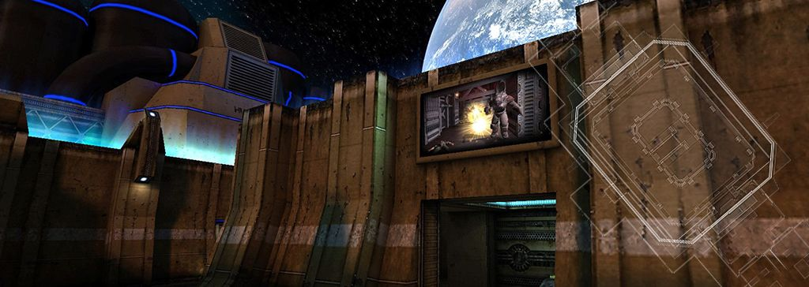 

## Overview: ATCS in Space

ATCS 2015 is a game level by Matthias "Masmblr" Peters for the open source game [_Tremulous_](https://tremulous.net/).

Map Description: 
> Welcome to ATCS_2015, an alternate version of the classic ATCS HD map (by Superpie & Ingar), but this time with a thrilling twist - we're taking the action to space! Get ready for an intergalactic adventure as you battle it out in a futuristic environment. ATCS_2015 offers a classic gameplay with new textures, particles and sounds. From the hum of the station's engines to the echoing clinks of your footsteps.
 
* * *

## Screenshots:
[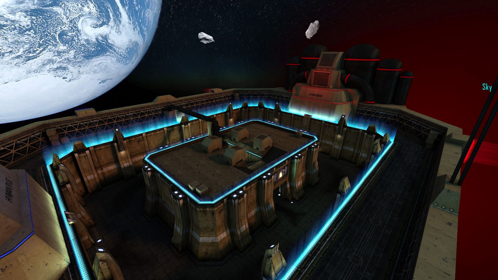](meta/preview_levelshots/1.jpg)
[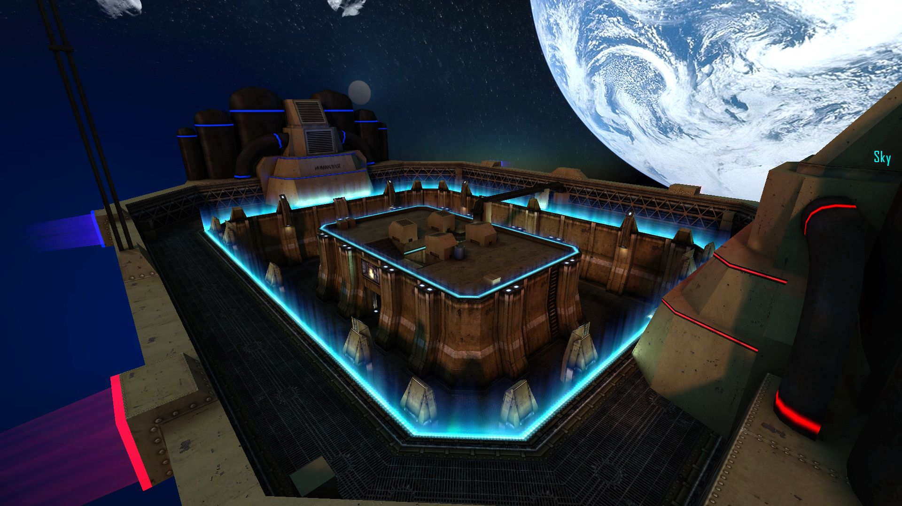](meta/preview_levelshots/2.jpg)
[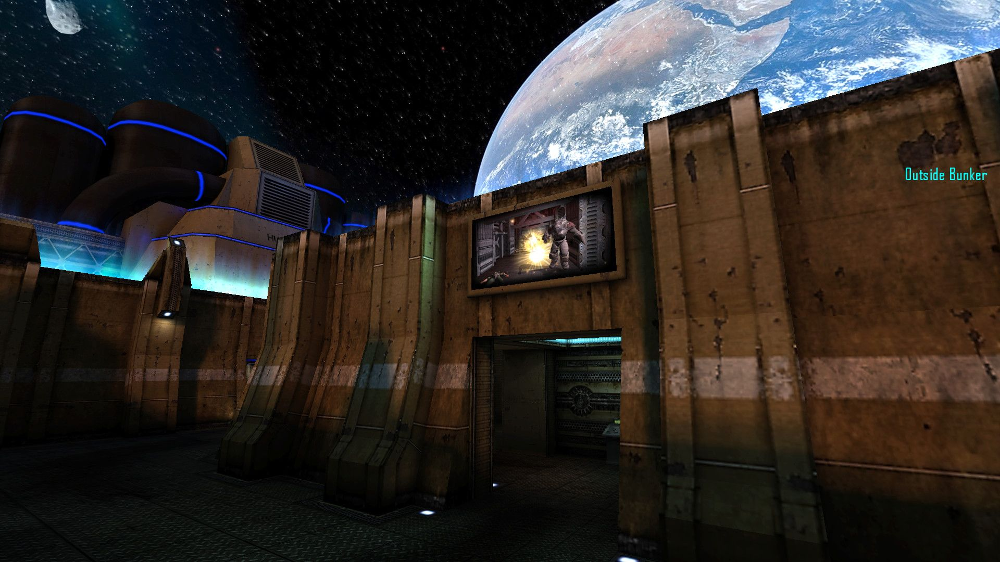](meta/preview_levelshots/3.jpg)
[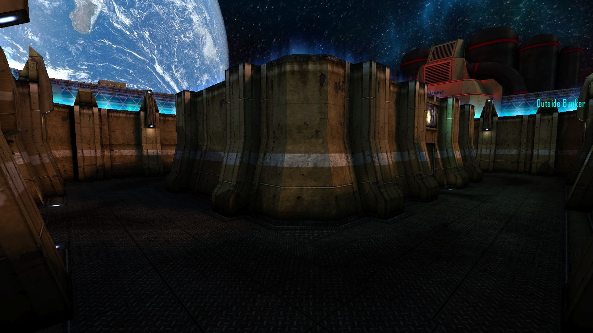](meta/preview_levelshots/4.jpg)
[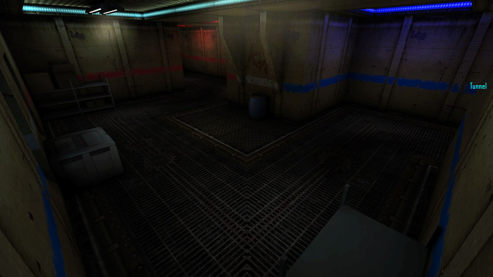](meta/preview_levelshots/5.jpg)
[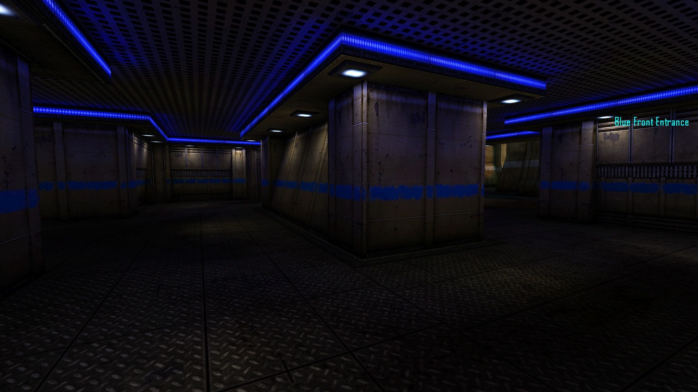](meta/preview_levelshots/6.jpg)
[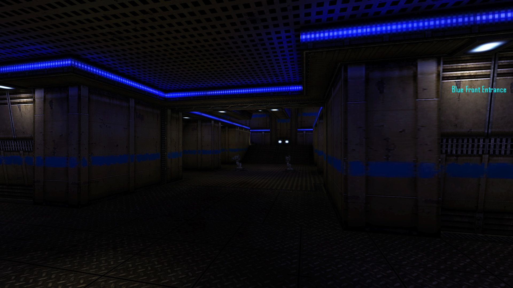](meta/preview_levelshots/7.jpg)
[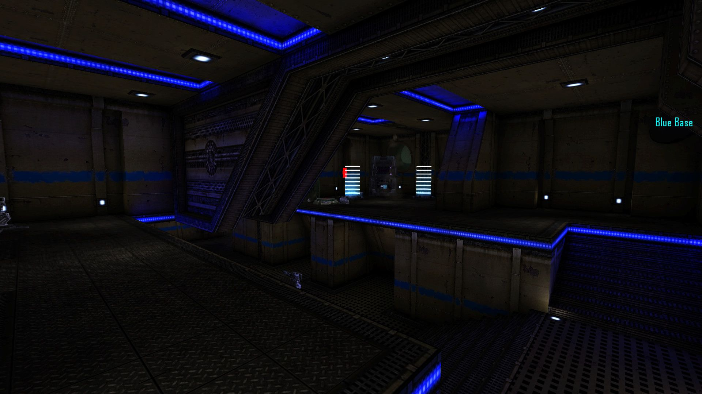](meta/preview_levelshots/8.jpg)
[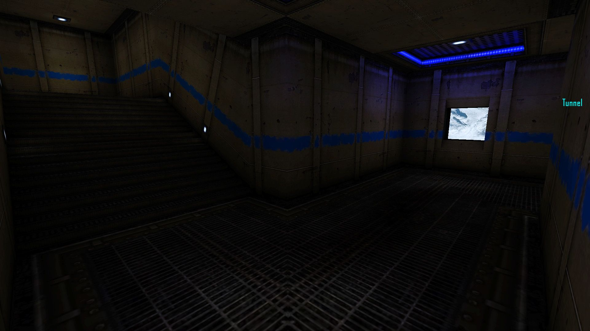](meta/preview_levelshots/9.jpg)
[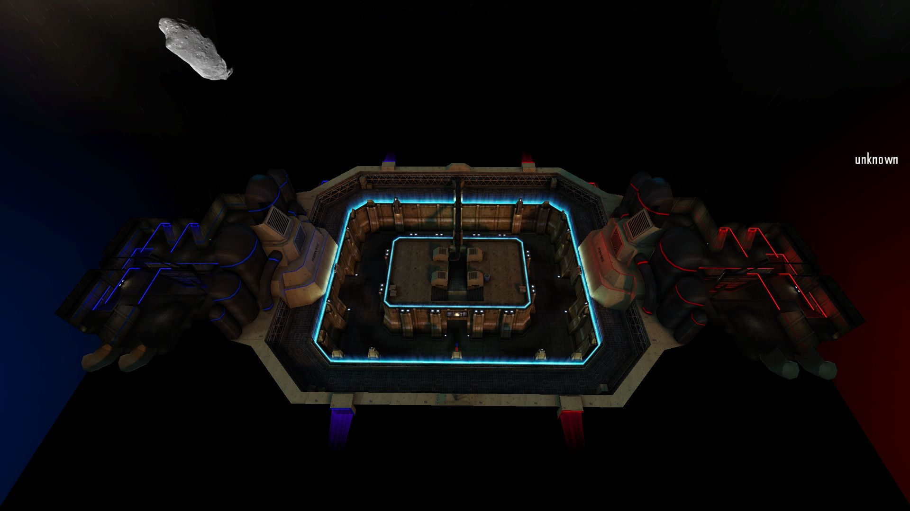](meta/preview_levelshots/10.jpg)

## Textures:
Some textures I have drawn for the map: </br>
[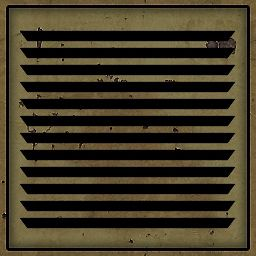](meta/preview_textures/1.jpg)
[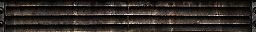](meta/preview_textures/2.jpg)
[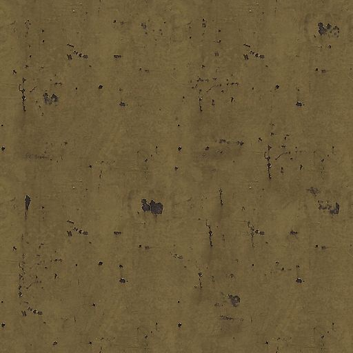](meta/preview_textures/3.jpg)
[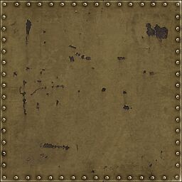](meta/preview_textures/4.jpg)
[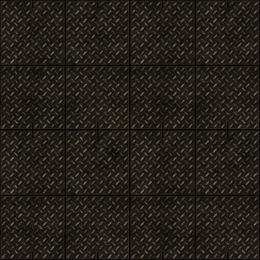](meta/preview_textures/5.jpg)
[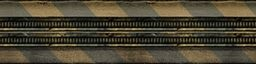](meta/preview_textures/6.jpg)
[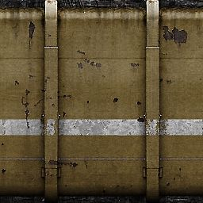](meta/preview_textures/7.jpg)
[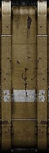](meta/preview_textures/8.jpg)
[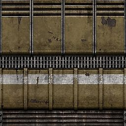](meta/preview_textures/9.jpg)
[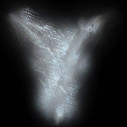](meta/preview_textures/10.jpg)
[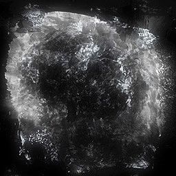](meta/preview_textures/11.jpg)
[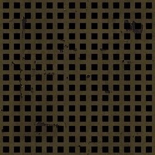](meta/preview_textures/12.jpg)
[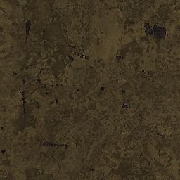](meta/preview_textures/13.jpg)
[](meta/preview_textures/14.jpg)
[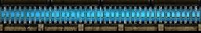](meta/preview_textures/15.jpg)
[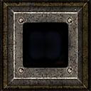](meta/preview_textures/16.jpg)
[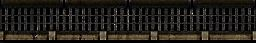](meta/preview_textures/17.jpg)
[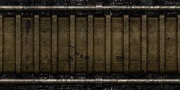](meta/preview_textures/18.jpg)
[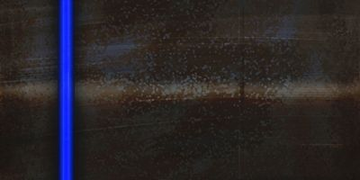](meta/preview_textures/19.jpg)
[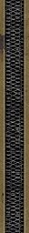](meta/preview_textures/20.jpg)

## Version History:
| Version: | Date:        | Status: | Release Build (.pk3):       
| ------- | ------------- | ------: | -----------------: |
| 2.0     | 19/10/2015  | beta | :x:        |     
| 2.1     | 27/10/2015  | beta | :x:        |   
| 2.2     | 30/10/2015  | beta | :x:        |   
| 3.0     | 02/11/2015  | beta | :x:        |   
| 3.1     | 05/11/2015  | beta | :x:        |   
| 3.2     | 09/11/2015  | beta | :x:        |  
| 3.3     | 10/11/2023  | final | [💾](https://github.com/Masmblr/map-ATCS_2015_src/releases/) |

## How-To
**Binary**:
1. Download the release package.
2. Save the *.pk3 file to the following directory: `/%PATH%/Tremulous/base/`.
3. Start the Tremulous game and select "Create Server" with the desired map.

**Source**:
1. Download the [source release](https://github.com/Masmblr/map-ATCS_2015_src/releases/) and the [tremulous-common-files](https://github.com/Masmblr/tremulous-map-common/releases/tag/v1.0).
2. Extract the files to the default installation directory. It should look like this:

```
DRIVE:/%PATH%/tremulous/
|   tremulous.exe
|   tremulous.x86
|   ...
+---base
|   |   autogen.cfg
|   |   data-1.1.0.pk3
|   |   map-atcs-1.1.0.pk3
|   |   ...
|   +---env
|   +---maps 
|   +---models 
|   +---scripts
|   +---sounds
|   \---textures
```
1. Download [NetRadiant Level Editor](https://netradiant.gitlab.io/page/download/).
2. Launch NetRadiant and select "Tremulous" as your game setting.
3. Open the '.map' file located in the directory `/%PATH%/tremulous/base/maps` and, from the menu, choose 'Build -> 'Build with final settings.'
4. Start the Tremulous game with `-sv_pure 0 -devmap MAPNAME`. Make sure to replace "MAPNAME" with the actual name of the map you compiled.

## Development Tools:
Photoshop CS6 \
[Audacity](https://www.audacityteam.org/) \
[NetRadiant](https://netradiant.gitlab.io/) \
[Q3Map2](http://q3map2.robotrenegade.com/)

## Related Resources:
Official Tremulous website: https://tremulous.net </br>
NET Radiant Level-Editor: https://netradiant.gitlab.io </br>
Master-Server-List: http://dpmaster.deathmask.net/?game=tremulous </br>
Unofficial successor "Unvanquished": https://unvanquished.net

## Legal Information and Attribution
Some assets may be derivative works or subject to different licenses. Please refer for author and license details. Note that some files may have been modified. Below is a list of files and their legal statuses.

***
env\atcs_2015\atcs_bk.jpg <sup>[1](#Credit-1)</sup> \
env\atcs_2015\atcs_dn.jpg <sup>[1](#Credit-1)</sup> \
env\atcs_2015\atcs_ft.jpg <sup>[1](#Credit-1)</sup> \
env\atcs_2015\atcs_lf.jpg <sup>[1](#Credit-1)</sup> \
env\atcs_2015\atcs_rt.jpg <sup>[1](#Credit-1)</sup> \
env\atcs_2015\atcs_up.jpg <sup>[1](#Credit-1)</sup> \
levelshots\atcs_2015.jpg <sup>[1](#Credit-1)</sup> \
maps\atcs_2015.map <sup>[1,7](#Credit-1)</sup> \
models\mapobjects\KOsAD\conteneur\Metal.jpg <sup>[2](#Credit-2)</sup> \
models\mapobjects\KOsAD\conteneur\barril2.md3 <sup>[2](#Credit-2)</sup> \
models\mapobjects\KOsAD\conteneur\bleu.jpg <sup>[2](#Credit-2)</sup> \
models\mapobjects\KOsAD\conteneur\etagere.md3 <sup>[2](#Credit-2)</sup> \
models\mapobjects\KOsAD\conteneur\poub5.jpg <sup>[2](#Credit-2)</sup> \
models\mapobjects\KOsAD\conteneur\rust06d.jpg <sup>[2](#Credit-2)</sup> \
models\mapobjects\KOsAD\conteneur\rust06e.jpg <sup>[2](#Credit-2)</sup> \
models\mapobjects\vega\box\box01.jpg <sup>[3](#Credit-3)</sup> \
models\mapobjects\vega\box\box01.obj <sup>[3](#Credit-3)</sup> \
models\mapobjects\vega\box\box02.obj <sup>[3](#Credit-3)</sup> \
models\mapobjects\vega\ceilinglight\ceilinglight2.ase <sup>[3](#Credit-3)</sup> \
models\mapobjects\vega\ceilinglight\ceilinglight2_a.jpg <sup>[3](#Credit-3)</sup> \
models\mapobjects\vega\ceilinglight\ceilinglight2_d.jpg <sup>[3](#Credit-3)</sup> \
models\mapobjects\vega\console\console.ase <sup>[3](#Credit-3)</sup> \
models\mapobjects\vega\console\console_base.jpg <sup>[3](#Credit-3)</sup> \
models\mapobjects\vega\console\console_screens.jpg <sup>[3](#Credit-3)</sup> \
models\mapobjects\vega\console\console_waveform.tga <sup>[3](#Credit-3)</sup> \
models\mapobjects\vega\container\container1.ase <sup>[3](#Credit-3)</sup> \
models\mapobjects\vega\container\container1.jpg <sup>[3](#Credit-3)</sup> \
models\mapobjects\vega\container\container2.ase <sup>[3](#Credit-3)</sup> \
models\mapobjects\vega\container\container2.jpg <sup>[3](#Credit-3)</sup> \
models\mapobjects\vega\toolcart\toolcart.jpg <sup>[3](#Credit-3)</sup> \
models\mapobjects\vega\toolcart\toolcart.md3 <sup>[3](#Credit-3)</sup> \
scripts\atcs_2015.arena <sup>[1](#Credit-1)</sup> \
scripts\atcs_2015.particle <sup>[1](#Credit-1)</sup> \
scripts\atcs_2015.shader <sup>[1](#Credit-1)</sup> \
scripts\shaderlist.txt <sup>[1](#Credit-1)</sup> \
textures\atcs_2015\atcs2015_ad.jpg <sup>[1](#Credit-1)</sup> \
textures\atcs_2015\atcs2015_ad_lines.jpg <sup>[1](#Credit-1)</sup> \
textures\atcs_2015\atcs2015_alienbase.jpg <sup>[1](#Credit-1)</sup> \
textures\atcs_2015\atcs2015_blueblink.jpg <sup>[1](#Credit-1)</sup> \
textures\atcs_2015\atcs2015_blueblinkfire.jpg <sup>[1](#Credit-1)</sup> \
textures\atcs_2015\atcs2015_bsk.tga <sup>[1](#Credit-1)</sup> \
textures\atcs_2015\atcs2015_decal1.jpg <sup>[1](#Credit-1)</sup> \
textures\atcs_2015\atcs2015_decal2.jpg <sup>[1](#Credit-1)</sup> \
textures\atcs_2015\atcs2015_decal3.jpg <sup>[1](#Credit-1)</sup> \
textures\atcs_2015\atcs2015_decal4.jpg <sup>[1](#Credit-1)</sup> \
textures\atcs_2015\atcs2015_flare.jpg <sup>[1](#Credit-1)</sup> \
textures\atcs_2015\atcs2015_forcefield.jpg <sup>[1](#Credit-1)</sup> \
textures\atcs_2015\atcs2015_grid.jpg <sup>[1](#Credit-1)</sup> \
textures\atcs_2015\atcs2015_ground_dirty.jpg <sup>[1](#Credit-1)</sup> \
textures\atcs_2015\atcs2015_humanbase.jpg <sup>[1](#Credit-1)</sup> \
textures\atcs_2015\atcs2015_ladder.tga <sup>[1](#Credit-1)</sup> \
textures\atcs_2015\atcs2015_light_blue.jpg <sup>[1](#Credit-1)</sup> \
textures\atcs_2015\atcs2015_light_blue_add.jpg <sup>[1](#Credit-1)</sup> \
textures\atcs_2015\atcs2015_light_forcefield.jpg <sup>[1](#Credit-1)</sup> \
textures\atcs_2015\atcs2015_light_forcefield_add.jpg <sup>[1](#Credit-1)</sup> \
textures\atcs_2015\atcs2015_light_quad.jpg <sup>[1](#Credit-1)</sup> \
textures\atcs_2015\atcs2015_light_quad_add.jpg <sup>[1](#Credit-1)</sup> \
textures\atcs_2015\atcs2015_light_red.jpg <sup>[1](#Credit-1)</sup> \
textures\atcs_2015\atcs2015_light_red_add.jpg <sup>[1](#Credit-1)</sup> \
textures\atcs_2015\atcs2015_light_white.jpg <sup>[1](#Credit-1)</sup> \
textures\atcs_2015\atcs2015_mech.jpg <sup>[1](#Credit-1)</sup> \
textures\atcs_2015\atcs2015_metal.jpg <sup>[1](#Credit-1)</sup> \
textures\atcs_2015\atcs2015_metal_blue.jpg <sup>[1](#Credit-1)</sup> \
textures\atcs_2015\atcs2015_metal_blue_add.jpg <sup>[1](#Credit-1)</sup> \
textures\atcs_2015\atcs2015_metal_red.jpg <sup>[1](#Credit-1)</sup> \
textures\atcs_2015\atcs2015_metal_red_add.jpg <sup>[1](#Credit-1)</sup> \
textures\atcs_2015\atcs2015_pil.jpg <sup>[1](#Credit-1)</sup> \
textures\atcs_2015\atcs2015_redblink.jpg <sup>[1](#Credit-1)</sup> \
textures\atcs_2015\atcs2015_redblinkfire.jpg <sup>[1](#Credit-1)</sup> \
textures\atcs_2015\atcs2015_shaft.jpg <sup>[1](#Credit-1)</sup> \
textures\atcs_2015\atcs2015_steam.jpg <sup>[1](#Credit-1)</sup> \
textures\atcs_2015\atcs2015_step.jpg <sup>[1](#Credit-1)</sup> \
textures\atcs_2015\atcs2015_sterne.jpg <sup>[1](#Credit-1)</sup> \
textures\atcs_2015\atcs2015_variable.jpg <sup>[1](#Credit-1)</sup> \
textures\atcs_2015\atcs2015_variable_dot.jpg <sup>[1](#Credit-1)</sup> \
textures\atcs_2015\atcs2015_variable_plates.jpg <sup>[1](#Credit-1)</sup> \
textures\atcs_2015\atcs2015_variable_warn.jpg <sup>[1](#Credit-1)</sup> \
textures\atcs_2015\atcs2015_wall_blue_01.jpg <sup>[1](#Credit-1)</sup> \
textures\atcs_2015\atcs2015_wall_blue_02.jpg <sup>[1](#Credit-1)</sup> \
textures\atcs_2015\atcs2015_wall_blue_03.jpg <sup>[1](#Credit-1)</sup> \
textures\atcs_2015\atcs2015_wall_red_01.jpg <sup>[1](#Credit-1)</sup> \
textures\atcs_2015\atcs2015_wall_red_02.jpg <sup>[1](#Credit-1)</sup> \
textures\atcs_2015\atcs2015_wall_red_03.jpg <sup>[1](#Credit-1)</sup> \
textures\atcs_2015\atcs2015_wall_white_01.jpg <sup>[1](#Credit-1)</sup> \
textures\atcs_2015\atcs2015_wall_white_02.jpg <sup>[1](#Credit-1)</sup> \
textures\atcs_2015\atcs2015_wall_white_dirty_01.jpg <sup>[1](#Credit-1)</sup> \
textures\atcs_2015\atcs2015_wall_white_dirty_02.jpg <sup>[1](#Credit-1)</sup> \
textures\atcs_2015\atcs_2015_earth.jpg <sup>[6](#Credit-6)</sup> \
textures\atcs_2015\atcs_2015_komet_1.jpg <sup>[5](#Credit-5)</sup> \
textures\atcs_2015\atcs_2015_komet_2.jpg <sup>[6](#Credit-6)</sup> \
textures\atcs_2015\atcs_2015_komet_3.jpg <sup>[6](#Credit-6)</sup> \
textures\atcs_2015\atcs_2015_moon.jpg <sup>[1](#Credit-1)</sup>
***

### Credit-1
[Matthias "Masmblr Peters"](mailto:masmblr@gmail.com) \
Content: Map, Textures, Shaders \
License: [MIT License](https://opensource.org/license/mit/).
(See "LICENSE" file for more Informations.)

### Credit-2
KOsAD \
Content: Conteneur models & shaders \
License: Attribution License

### Credit-3
[Stijn “Ingar” Buys](http://ingar.intranifty.net/) \
Content: Vega models & shadersl \
License: Attribution License

### Credit-4
Darklegion Development \
Content: Tremulous-Panel image \
License: Attribution License

### Credit-5
ESA 2010 \
Content: Asteroid 1 (Lutetia) image \
License: CC BY-SA 2.0

### Credit-6
NASA \
Content: Earth, Asteroid 2 and 3, Moon images \
License: Public Domain

### Credit-7
Superpie, Ingar \
Content: Base-Brushwork (ATCS HD) \
License: Attribution License

For all other content, their respective licensing rules and other legal provisions apply.

## Special Thanks:
* id Software for Quake3
* Dark Legion Development for Tremulous
* Team Xonotic for NetRadiant 
